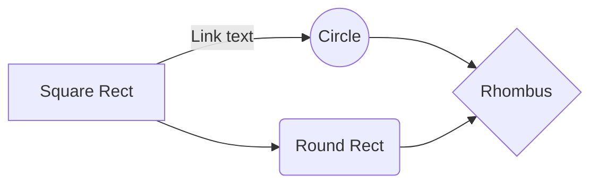

```md
Welcome To My Github account
```
---


### Hi there 👋
### 
I Am ROHIT KUMAR GUPTA COMPUTER SCIENCE STUDENT,IEM KOLKATA
---
```css
Skill
```
- WEB DEVELOPMENT
- CODING
- MACHINE LEARNING AND DEEP LEARNING
- WEB SCRAPING AND AUTOMATION
- COMMAND LINE INTERFACE
- VERSION CONTROL AND GOOGLE ACTION
- GOOGLE CLOUD

```md
PROJECT --------COMING SOON
```

- 📫 How to reach me:Linkedin ->https://www.linkedin.com/in/rohit-kumar-gupta-15655b183/
- 🌱 I’m currently learning ...Machine Learning and Deep learning

-  🏢 Institute Of Engineering And Management Kolkata

---

| PROFILE | LINK |DESCRIPTION|
| ------ | ------ | ------ |
| GitHub | https://github.com/rohitdhonicsk/rohitdhonicsk | THIS IS MY GITHUB PROFILE WHERE I UPLOAD SOME OF PROJECT FROM MY MACHINE.DO FOLLOW ME
| Linkedin | https://www.linkedin.com/in/rohit-kumar-gupta-15655b183/ | THIS IS MY LINKEDIN PROFILE,YOU WILL GET TO KNOW MY INTERNSHIP,ACHEIVEMENT,PROJECT,AND COURSE CERTIFICATE
| Techgig | https://www.techgig.com/karanrohitgupta | I had Given Many skill test in this website
| Qwiklab | https://google.qwiklabs.com/public_profiles/26ca5cea-40af-47e8-b3a1-3a46b7a0839e | View My badges and Lab That i completed
| GEEKSFORGEEKS| https://auth.geeksforgeeks.org/user/rohitguptaiem/practice/ | Coding Profile
| HackerRanK | https://www.hackerrank.com/karnal_narayana | here i DO coding,learning and given 3 Skill test
| Codechef | https://www.codechef.com/users/karnalrohit | I am Active User OF Codechef ,I take part in long challenge



<div style="display:flex;width:100%;align-item:center;justify-content:space-around" >

  
    
  </div>
  
---
<!--    -->
  
</div>

<!--
**rohitdhonicsk/rohitdhonicsk** is a ✨ _special_ ✨ repository because its `README.md` (this file) appears on your GitHub profile.

Here are some ideas to get you started:

-  🏢 Institute Of Engineering And Management Kolkata
- 🔭 I’m currently working on ...
- 🌱 I’m currently learning ...Machine Learning and Deep learning
- 👯 I’m looking to collaborate on ...
- 🤔 I’m looking for help with ...
- 💬 Ask me about ...
- 📫 How to reach me:Linkedin ->https://www.linkedin.com/in/rohit-kumar-gupta-15655b183/
- 😄 Pronouns: ...
- ⚡ Fun fact: ...
-->
 
